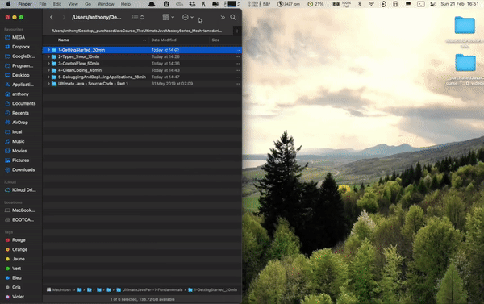

# video_compressor.py<!-- omit in toc -->

Python program that compresses ".mp4" and ".mov" file(s) from a video file path or videos folder path saved in the clipboard or provided as a command line argument.

## Table of contents<!-- omit in toc -->

- [1. Description](#1-description)
- [2. Getting started](#2-getting-started)
  - [2.1 Dependencies](#21-dependencies)
  - [2.2 Installing](#22-installing)
  - [2.3 Executing program](#23-executing-program)
- [3. Version history](#3-version-history)

<!-- toc -->

## 1. Description

`video_compressor.py` is a Python program that allows to compress a single or a bunch of ".mp4" and ".mov" video files providing either the absolute video file path or the absolute videos folder path. The software leverages the `ffmpeg` video and audio converter command line. It uses a CRF (Constant Rate Factor) of 35 and eventually reduces the video format to shrink the video size by up to 10 times.

\
Important point to notice:

- The video file path or videos folder path must not contain any special characters such as " ' ", "(", ")", etc.
- The `VidComp` Alfred workflow implements the `video_compressor.py` Python program. After installing the [Alfred macOS app](https://www.alfredapp.com) and the `VidComp` workflow, simply copy a video file path or videos folder path to the clipboard and then type the `vc` hotkey in the Alfred search bar. The `video_compressor.py` Python program is then automatically triggered and runs in a Terminal window. The Terminal window is exited automatically at the end of the program using an Osascript command.
  

	

## 2. Getting started

### 2.1 Dependencies

- Tested on macOS Big Sur version 11.2.1
- Python 3.7

### 2.2 Installing

`pip install -r requirements.txt`

### 2.3 Executing program

- To access useful help messages, type following Terminal command at the root of
  the project:
  
  `python3.7 video_compressor.py -h`

- To compress a set of videos in a target folder or a single video file using
  the absolute path saved in the clipboard, type following command at the root
  of the project:
  
  `python3.7 video_compressor.py`

  The program will automatically get the clipboard stored videos folder path or
  video file path and generate a compressed version of the video file(s).

- To compress a set of videos in a target folder or a single video file using
  the absolute path provided as a command line argument, type following Terminal
  command at the root of the project:
  
  `python3.7 video_compressor.py --path /my/video/file/or/folder/path`

  The program will automatically use the videos folder path or video file path
  and generate a compressed version of the video file(s). When using the command
  line argument, note that the path must not contain any empty space.

## 3. Version history

- 0.1
  - Initial release
